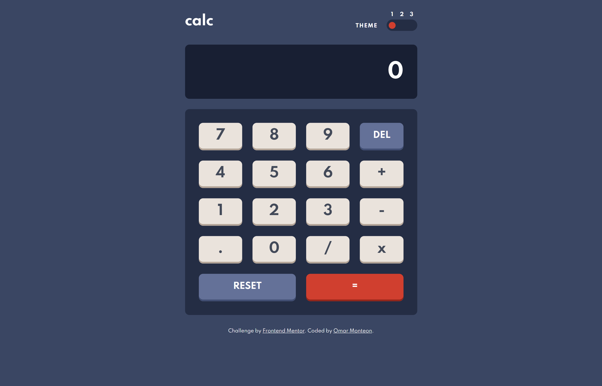

# Frontend Mentor - Calculator app solution

Hi there 👋

Welcome to my solution to the [Calculator app challenge on Frontend Mentor](https://www.frontendmentor.io/challenges/calculator-app-9lteq5N29). This was a fun project that helped me learned new concepts and reinforce other ones. All feedback is appreciated 😀🙏

## Table of contents

- [Overview](#overview)
  - [The challenge](#the-challenge)
  - [Screenshot](#screenshot)
  - [Links](#links)
- [My process](#my-process)
  - [Built with](#built-with)
  - [What I learned](#what-i-learned)
  - [Continued development](#continued-development)
  - [Useful resources](#useful-resources)
- [Author](#author)

## Overview

### The challenge

Users should be able to:

- See the size of the elements adjust based on their device's screen size
- Perform mathematical operations like addition, subtraction, multiplication, and division
- Adjust the color theme based on their preference
- **Bonus**: Have their initial theme preference checked using `prefers-color-scheme` and have any additional changes saved in the browser

### Screenshot

### Links

- Solution URL: [Github repo](https://github.com/omonteon/calculator-fem)
- Live Site URL: [Calculator app](https://boring-tesla-ab4ebe.netlify.app/)

## My process

### Built with

- CSS custom properties
- Flexbox
- CSS Grid
- Mobile-first workflow
- [React](https://reactjs.org/) - JS library

### What I learned

This was my first time using:

- CSS custom properties.
- CSS grid.
- Color scheme media query
- BEM

I had not implemented a FSM(finite state machine) since university. I had fun remembering about this concept. I also found out about abstractions to implement FSMs easily like XState. I'll probably use XState in the future when I need to use a FSM.

Working with this project helped me solidify concepts regarding React hooks, which I use at my job, but not always since a lot of legacy code is still implemented using class based components.

### Continued development

I want to continue familiarizing with CSS grid, I feel I learned enough to use it for this implementation, but there is a lot more to know.

### Useful resources

- [CSS custom properties(MDN)](https://developer.mozilla.org/en-US/docs/Web/CSS/Using_CSS_custom_properties) - This helped me to learn and use CSS custom properties for the first time. I used custom properties to easily change between different themes.
- [Custom checkboxes/Radios (tutsplus)](https://webdesign.tutsplus.com/tutorials/how-to-make-custom-accessible-checkboxes-and-radio-buttons--cms-32074) - This helped me remember how to build custom radio buttons from scratch. I had done this before, but lately I've been using a components library at my job, this is why I needed the refresher.
- [Format numbers to be separated by commas](https://stackoverflow.com/questions/2901102/how-to-print-a-number-with-commas-as-thousands-separators-in-javascript) - Since solving this problem was not my focus with this challenge, I took this solution. Also, I learned that some Regex features are not yet supported by all browsers.
- [Dark mode (Josh Comeau blog)](https://www.joshwcomeau.com/react/dark-mode/#adding-a-toggle) - This was my first time implementing dark mode or custom themes in a web app, and Josh Comeau's article was very helpful.
- [3D button (Josh Comeau blog)](https://www.joshwcomeau.com/animation/3d-button/) - I remembered reading this article and wanting to use a 3D button in some project. Even though I didn't use the exact same implementation as the article, it helped me have a good idea of what I should do.
- [CSS Grid for the number pad](https://learncssgrid.com/) - First time using CSS grid. This website was very useful.
- [Module bundling with Parcel(Brian Holt)](https://btholt.github.io/complete-intro-to-react-v5/parcel) - I wante to give Parcel a try. It turned out to be really easy to use.

## Author

- Github - [Omar Monteon](https://github.com/omonteon)
- Frontend Mentor - [@omonteon](https://www.frontendmentor.io/profile/omonteon)
